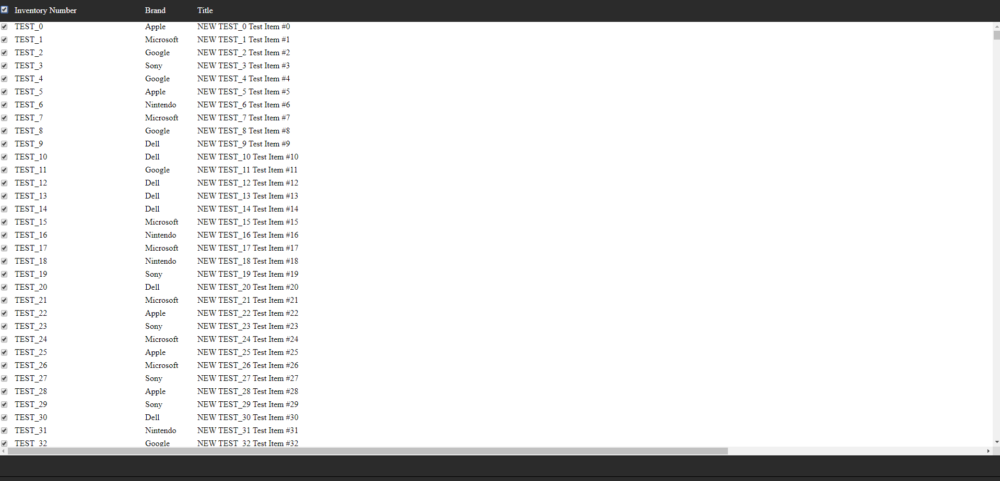

<h1>AxionGrid</h1>

AxionGrid is an advanced JavaScript data grid / table component.  The goal of this project is to be able to render 
tables that are thousands of rows long or more without negatively effecting page speed.  It does this by virtualizing
the dom by only apply rows to the dom that are currently visible.

Status:
Project has currently been abandoned.

